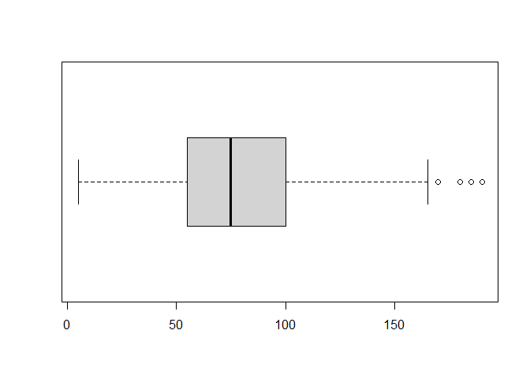
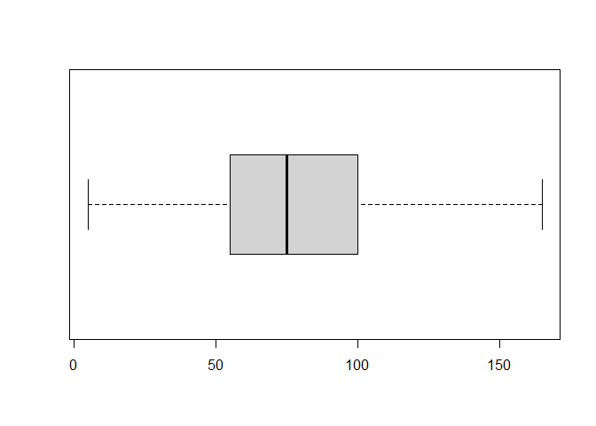
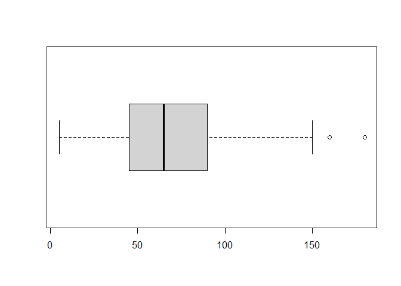
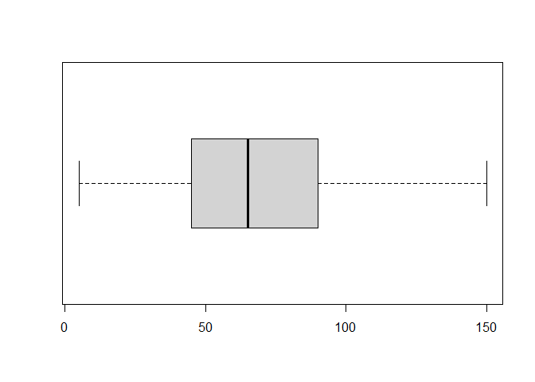

tarea3\_ayudantia
================

## Estivaliz Rosales

## Actividad 3:

Replicar el analisis de outliers, debes elegir uno de los dos csv
disponibles (pokemon o titanic) y realizar el analisis con algunas de
las variables numericas y realizar un pequeño analisis en relacion a los
datos encontrados como outliers (en caso de que eligas el csv del
titanic solo debes evaluar las columnas AGE y FNLWGT)

## Cargar datos

Como bien sabemos, lo primero que debemos hacer es cargar los datos a
nuestro R

``` r
wd = setwd("C:/Users/JuanRosales/OneDrive/Mineria de datos/tarea 3")
pk = read.csv("pokemon.csv")
#pk
head(pk)
```

    ##   X.                  Name Type.1 Type.2 Total HP Attack Defense Sp..Atk
    ## 1  1             Bulbasaur  Grass Poison   318 45     49      49      65
    ## 2  2               Ivysaur  Grass Poison   405 60     62      63      80
    ## 3  3              Venusaur  Grass Poison   525 80     82      83     100
    ## 4  3 VenusaurMega Venusaur  Grass Poison   625 80    100     123     122
    ## 5  4            Charmander   Fire          309 39     52      43      60
    ## 6  5            Charmeleon   Fire          405 58     64      58      80
    ##   Sp..Def Speed Generation Legendary
    ## 1      65    45          1     False
    ## 2      80    60          1     False
    ## 3     100    80          1     False
    ## 4     120    80          1     False
    ## 5      50    65          1     False
    ## 6      65    80          1     False

## Limpieza de datos

Para poder hacer un correcto analisis de datos, primero vamos a elimiar
todas las columnas de datos que no utilizaremos, en nuestro caso, solo
nos quedaremos con ataque y velocidad.

``` r
#pk
pk <-  pk[, !(colnames(pk)%in% c("Name","Type.1","Type.2", "Total" , "HP" , "Defense","Generation","Legendary","Sp..Atk","Sp..Def" ))]
#pk
head(pk)
```

    ##   X. Attack Speed
    ## 1  1     49    45
    ## 2  2     62    60
    ## 3  3     82    80
    ## 4  3    100    80
    ## 5  4     52    65
    ## 6  5     64    80

## Primer boxplot

``` r
attach(pk)
att = boxplot(Attack, horizontal = TRUE)
```

<!-- -->

``` r
stats_att = boxplot.stats(Attack)
att
```

    ## $stats
    ##      [,1]
    ## [1,]    5
    ## [2,]   55
    ## [3,]   75
    ## [4,]  100
    ## [5,]  165
    ## attr(,"class")
    ##         1 
    ## "integer" 
    ## 
    ## $n
    ## [1] 800
    ## 
    ## $conf
    ##          [,1]
    ## [1,] 72.48624
    ## [2,] 77.51376
    ## 
    ## $out
    ## [1] 190 185 180 180 180 170 170
    ## 
    ## $group
    ## [1] 1 1 1 1 1 1 1
    ## 
    ## $names
    ## [1] "1"

``` r
stats_att
```

    ## $stats
    ## [1]   5  55  75 100 165
    ## 
    ## $n
    ## [1] 800
    ## 
    ## $conf
    ## [1] 72.48624 77.51376
    ## 
    ## $out
    ## [1] 190 185 180 180 180 170 170

Como se puede apresiar, ahora contamos con 800 datos, de los cuales 7
son “atipicos”, por lo tanto deben ser eliminados para poder hacer un
analisis mas acertado. ahora procedemos a eliminar dichos datos.

``` r
pk1 <- Attack[Attack < 170]
length(Attack) - length(pk1)
```

    ## [1] 7

``` r
boxplot(pk1, horizontal = TRUE)
```

<!-- -->

Ahora haremos lo mismo con los datos de velocidad

``` r
def = boxplot(Speed, horizontal = TRUE)
```

<!-- -->

``` r
stats_def = boxplot.stats(Speed)
def
```

    ## $stats
    ##      [,1]
    ## [1,]    5
    ## [2,]   45
    ## [3,]   65
    ## [4,]   90
    ## [5,]  150
    ## attr(,"class")
    ##         1 
    ## "integer" 
    ## 
    ## $n
    ## [1] 800
    ## 
    ## $conf
    ##          [,1]
    ## [1,] 62.48624
    ## [2,] 67.51376
    ## 
    ## $out
    ## [1] 160 180
    ## 
    ## $group
    ## [1] 1 1
    ## 
    ## $names
    ## [1] "1"

``` r
stats_def
```

    ## $stats
    ## [1]   5  45  65  90 150
    ## 
    ## $n
    ## [1] 800
    ## 
    ## $conf
    ## [1] 62.48624 67.51376
    ## 
    ## $out
    ## [1] 160 180

En este caso, son dos solamente los datos alejados, por ende los
eliminaremos.

``` r
pk2 <- Speed[Speed < 160]
length(Speed) - length(pk2)
```

    ## [1] 2

``` r
boxplot(pk2, horizontal = TRUE)
```

<!-- -->
